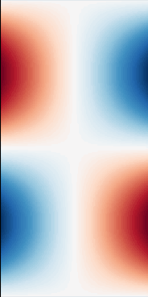

Examples
========

The `examples/ <https://github.com/AdirondaxProject/adirondax/tree/main/examples>`_ directory contains a collection of astrophysics simulations demonstrating various applications of the Adirondax library.

Gallery
-------

.. list-table::
   :widths: 25 25 25 25
   :header-rows: 0

   * - .. figure:: ../../examples/kelvin_helmholtz/movie.gif
         :height: 128px
         :align: center
         :alt: kelvin_helmholtz
         :target: examples.html#kelvin-helmholtz

     - .. figure:: ../../examples/logo_inverse_problem/movie.gif
         :height: 128px
         :align: center
         :alt: logo_inverse_problem
         :target: examples.html#logo-inverse-problem

     - .. figure:: ../../examples/orszag_tang/movie.gif
         :height: 128px
         :align: center
         :alt: orszag_tang
         :target: examples.html#orszag-tang

     - .. figure:: ../../examples/rayleigh_taylor/movie.gif
         :height: 128px
         :align: center
         :alt: rayleigh_taylor
         :target: examples.html#rayleigh-taylor

   * - .. figure:: ../../examples/brio_wu/movie.gif
         :height: 128px
         :align: center
         :alt: brio_wu
         :target: examples.html#brio-wu

     - .. figure:: ../../examples/sod/movie.gif
         :height: 128px
         :align: center
         :alt: sod
         :target: examples.html#sod

     - .. figure:: ../../examples/sedov/movie.gif
         :height: 128px
         :align: center
         :alt: sedov
         :target: examples.html#sedov

     - .. figure:: ../../examples/alfven_wave/movie.gif
         :height: 128px
         :align: center
         :alt: alfven_wave
         :target: examples.html#alfven-wave

kelvin_helmholtz
----------------

  See on GitHub: `examples/kelvin_helmholtz <https://github.com/AdirondaxProject/adirondax/tree/main/examples/kelvin_helmholtz>`_

README:

.. literalinclude:: ../../examples/kelvin_helmholtz/README.md
  :language: md

Script:

.. literalinclude:: ../../examples/kelvin_helmholtz/kelvin_helmholtz.py
  :language: python

logo_inverse_problem
--------------------

.. figure:: ../../examples/logo_inverse_problem/movie.gif
  :height: 256px
  :align: center
  :alt: logo_inverse_problem
  :target: examples.html#logo-inverse-problem

  See on GitHub: `examples/logo_inverse_problem <https://github.com/AdirondaxProject/adirondax/tree/main/examples/logo_inverse_problem>`_

README:

.. literalinclude:: ../../examples/logo_inverse_problem/README.md
  :language: md

Script:

.. literalinclude:: ../../examples/logo_inverse_problem/logo_inverse_problem.py
  :language: python

orszag_tang
-----------

  See on GitHub: `examples/orszag_tang <https://github.com/AdirondaxProject/adirondax/tree/main/examples/orszag_tang>`_

README:

.. literalinclude:: ../../examples/orszag_tang/README.md
  :language: md

Script:

.. literalinclude:: ../../examples/orszag_tang/orszag_tang.py
  :language: python

rayleigh_taylor
---------------

  See on GitHub: `examples/rayleigh_taylor <https://github.com/AdirondaxProject/adirondax/tree/main/examples/rayleigh_taylor>`_

README:

.. literalinclude:: ../../examples/rayleigh_taylor/README.md
  :language: md

Script:

.. literalinclude:: ../../examples/rayleigh_taylor/rayleigh_taylor.py
  :language: python

alfven_wave
-----------

  See on GitHub: `examples/alfven_wave <https://github.com/AdirondaxProject/adirondax/tree/main/examples/alfven_wave>`_

README:

.. literalinclude:: ../../examples/alfven_wave/README.md
  :language: md

Script:

.. literalinclude:: ../../examples/alfven_wave/alfven_wave.py
  :language: python

brio_wu
-------

  See on GitHub: `examples/brio_wu <https://github.com/AdirondaxProject/adirondax/tree/main/examples/brio_wu>`_

README:

.. literalinclude:: ../../examples/brio_wu/README.md
  :language: md

Script:

.. literalinclude:: ../../examples/brio_wu/brio_wu.py
  :language: python

sod
---

  See on GitHub: `examples/sod <https://github.com/AdirondaxProject/adirondax/tree/main/examples/sod>`_

README:

.. literalinclude:: ../../examples/sod/README.md
  :language: md

Script:

.. literalinclude:: ../../examples/sod/sod.py
  :language: python

sedov
-----

  See on GitHub: `examples/sedov <https://github.com/AdirondaxProject/adirondax/tree/main/examples/sedov>`_

README:

.. literalinclude:: ../../examples/sedov/README.md
  :language: md

Script:

.. literalinclude:: ../../examples/sedov/sedov.py
  :language: python
