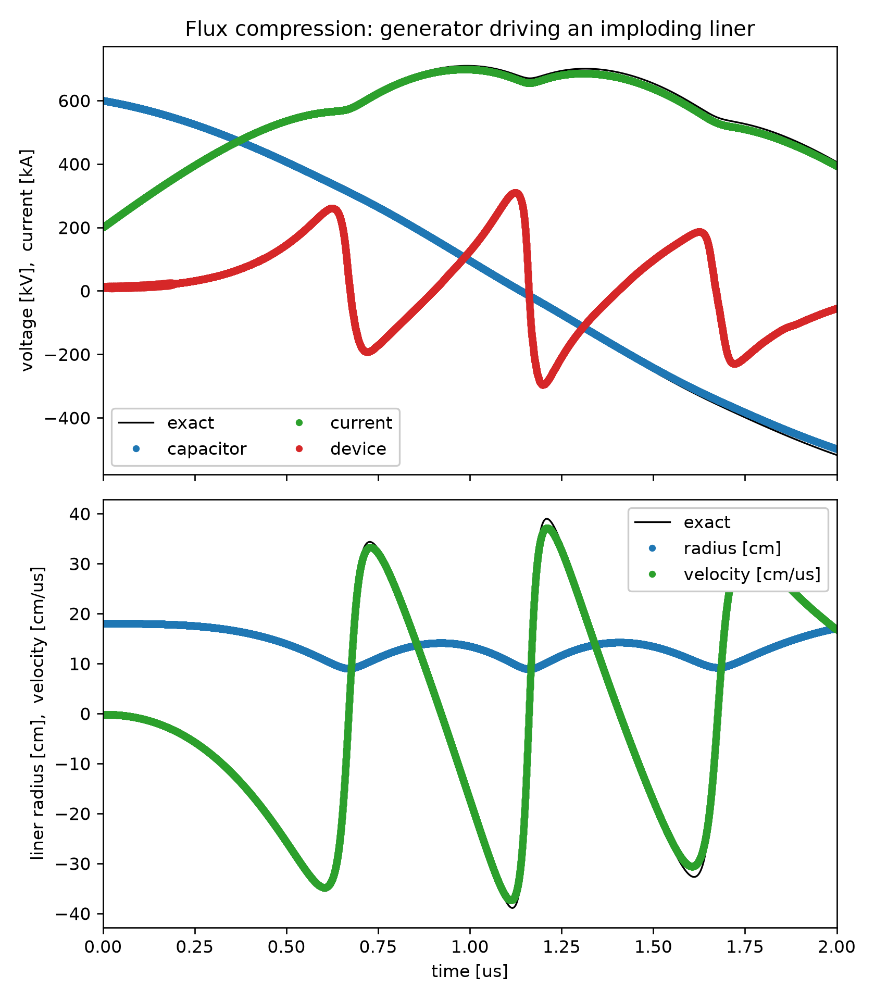

# Flux compression

Simulate a pulsed power generator driving an imploding liner

Philip Mocz (2026)

Usage:

```console
python flux_compression.py
```

Needs `spicex` for the circuit, from
[`requirements-examples.txt`](../../requirements-examples.txt).

Takes around 6 minutes to run on my macbook (cpu).

A capacitor bank drives current through a coaxial device. An 80 µg liner sits
between a driven vacuum and a trapped one, and is imploded by the current
outside while the flux compressed inside pushes back, so it rings rather than
collapsing. The vacuum is an ideal, perfectly conducting fluid, not a resistive
one. All of the mass is in a thin shell, so the problem also reduces to four
ordinary differential equations, which the script integrates and plots against.


## Simulation snapshots

<div style="display:flex;flex-wrap:wrap;gap:8px">
  
  
</div>


## References

[Beresnyak, A. et al.; Simulating a pulsed power-driven plasma with ideal MHD (2022)](https://arxiv.org/abs/2205.03358)

[White, D.A.; Using the Sherman-Morrison-Woodbury Formula for Coupling External Circuits With FEM for Simulation of Eddy Current Problems. IEEE Transactions on Magnetics (2009)](https://ieeexplore.ieee.org/document/5257212)
