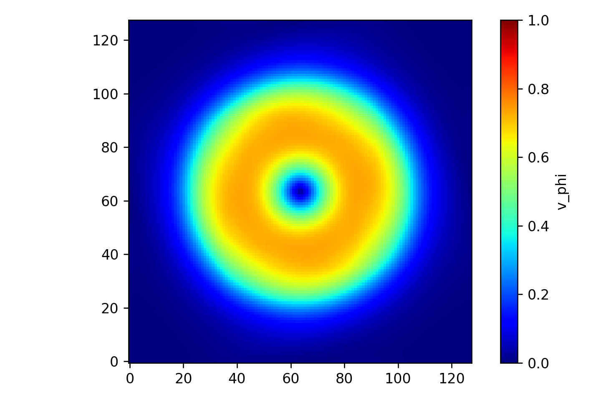

# Gresho

Simulate the Gresho Vortex

Philip Mocz (2025)

Usage:

```console
python gresho.py
```

Takes around 10 seconds to run on my macbook (cpu).


## Simulation snapshots

<div style="display:flex;flex-wrap:wrap;gap:8px">
  
</div>


## References

[Gresho, P.M.; Chen, S.T.; On the theory of semi-implicit projection methods for viscous incompressible flow and its implementation via a finite element method that also introduces a nearly consistent mass matrix. II - Implementation. International Journal for Numerical Methods in Fluids (1990)](https://ui.adsabs.harvard.edu/abs/1990IJNMF..11..621G)

[Liska, R. ; Wendroff, B.; Comparison of Several Difference Schemes on 1D and 2D Test Problems for the Euler Equations. SIAM Journal on Scientific Computing (2003)](https://ui.adsabs.harvard.edu/abs/2003SJSC...25..995L)
