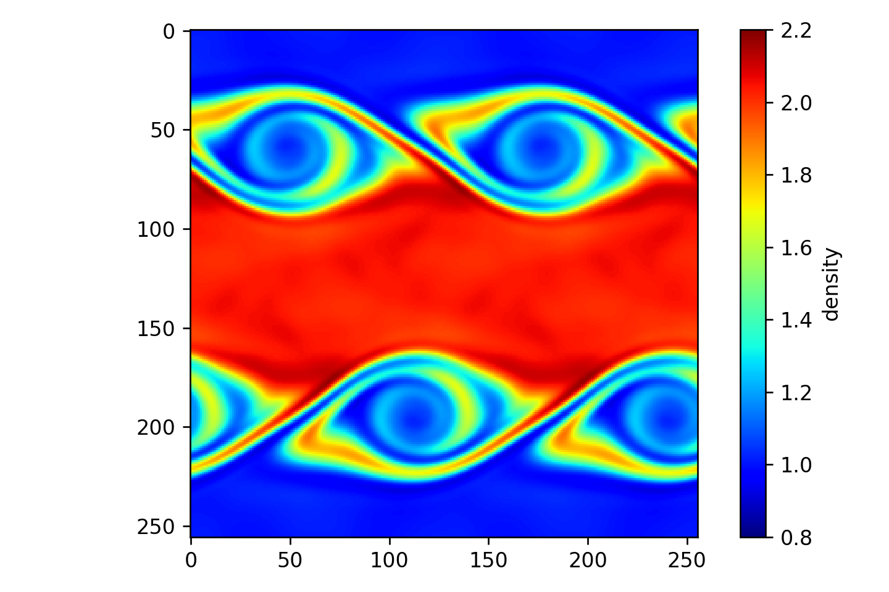

# Kelvin-Helmholtz

Simulate the Kelvin-Helmholtz Instability (Euler equations)

Philip Mocz (2025)

Usage:

```console
python kelvin_helmholtz.py
```

Takes around 6 seconds to run on my macbook (cpu).


## Simulation snapshots

<div style="display:flex;flex-wrap:wrap;gap:8px">
  
</div>


## References

[Springel, V.; E pur si muove: Galilean-invariant cosmological hydrodynamical simulations on a moving mesh. Monthly Notices of the Royal Astronomical Society (2020)](https://ui.adsabs.harvard.edu/abs/2010MNRAS.401..791S)
