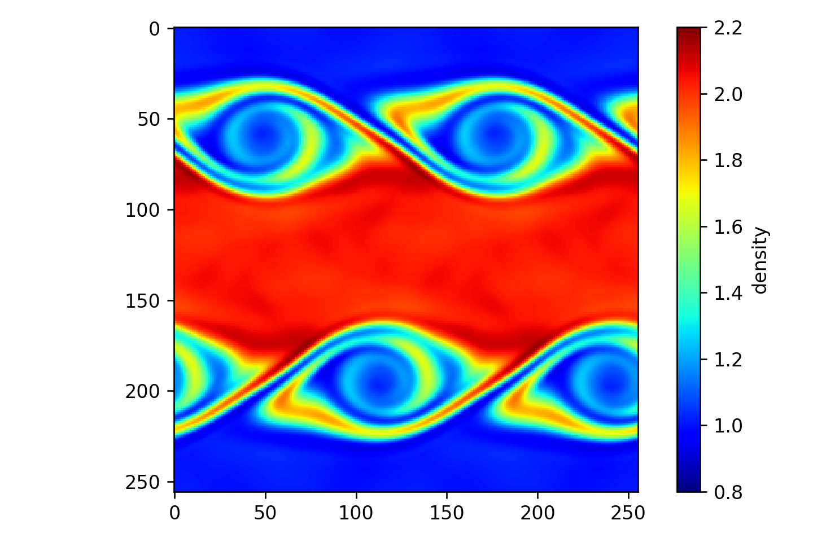

# Kelvin-Helmholtz Instability

Simulate the Kelvin-Helmholtz Instability (Euler equations)

Philip Mocz (2025)

Usage:

```console
python kelvin_helmholtz_instability.py
```

Takes around 6 seconds to run on my macbook (cpu).

## Simulation snapshots

<div style="display:flex;flex-wrap:wrap;gap:8px">
  
</div>
