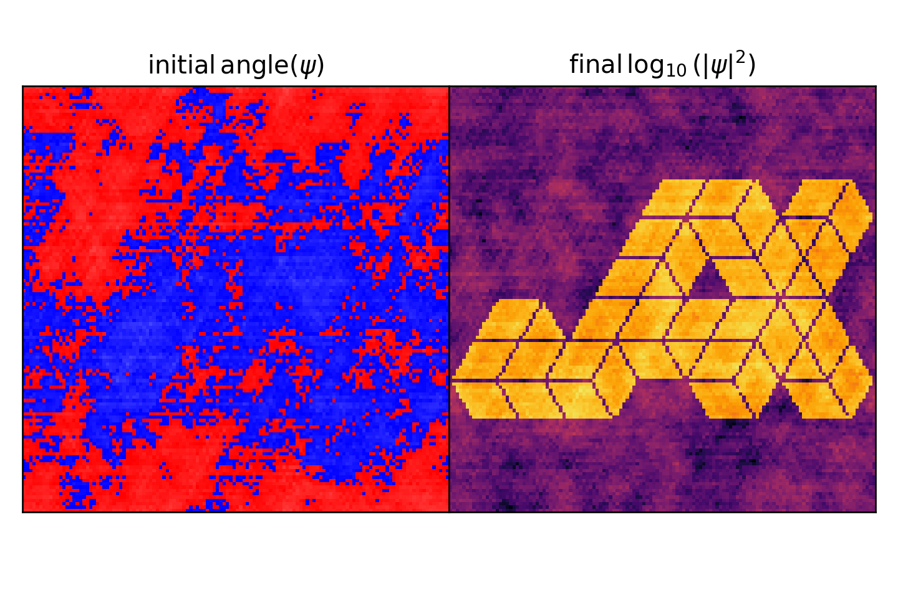

# Logo Inverse Problem

Inverse problem with the Schrodinger-Poisson system.
Find initial phases that evolve system into the JAX logo.

Philip Mocz (2025)

Usage:

```console
python logo_inverse_problem.py
```

Takes around 2 seconds to run on my macbook (cpu).


## Simulation snapshots

<div style="display:flex;flex-wrap:wrap;gap:8px">
  
</div>
