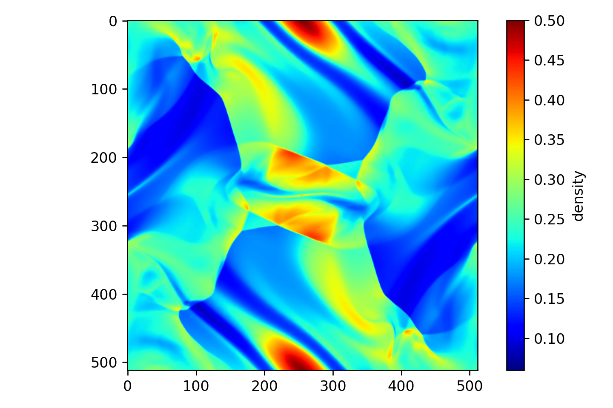

# Orszag-Tang

Simulate the Orszag-Tang vortex (2D MHD equations)

Philip Mocz (2025)

Usage:

```console
python orszag_tang.py
```

Takes around 55 seconds ('llf') / 105 seconds ('hlld') to run on my macbook (cpu).


## Simulation snapshots

<div style="display:flex;flex-wrap:wrap;gap:8px">
  
</div>


## References

[Orszag, S.A.; Tang, C.M.; Small-scale structure of two-dimensional magnetohydrodynamic turbulence. Journal of Fluid Mechanics (1979)](https://ui.adsabs.harvard.edu/abs/1979JFM....90..129O)
