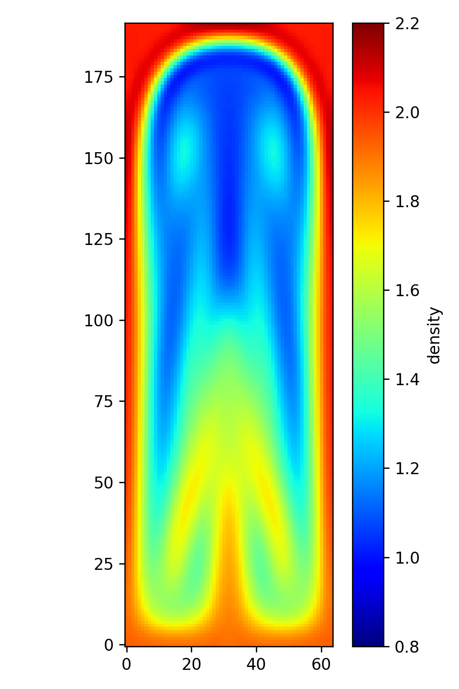

# Rayleigh-Taylor

Simulate the Rayleigh-Taylor Instability (Euler equations)

Philip Mocz (2025)

Usage:

```console
python rayleigh_taylor.py
```

Takes around 9 seconds to run on my macbook (cpu).


## Simulation snapshots

<div style="display:flex;flex-wrap:wrap;gap:8px">
  
</div>
