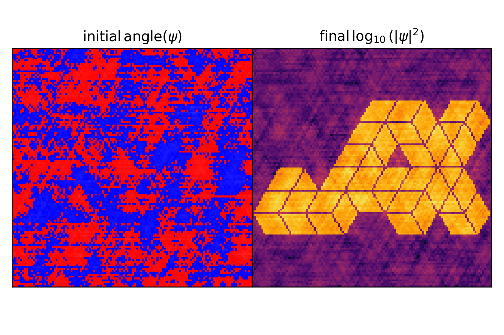

# Schrodinger-Poisson

Inverse problem with the Schrodinger-Poisson system.

Philip Mocz (2025)

Usage:

```console
python schrodinger_poisson.py
```

Takes around 6 seconds to run on my macbook (cpu).

## Simulation snapshots

<div style="display:flex;flex-wrap:wrap;gap:8px">
  
</div>
